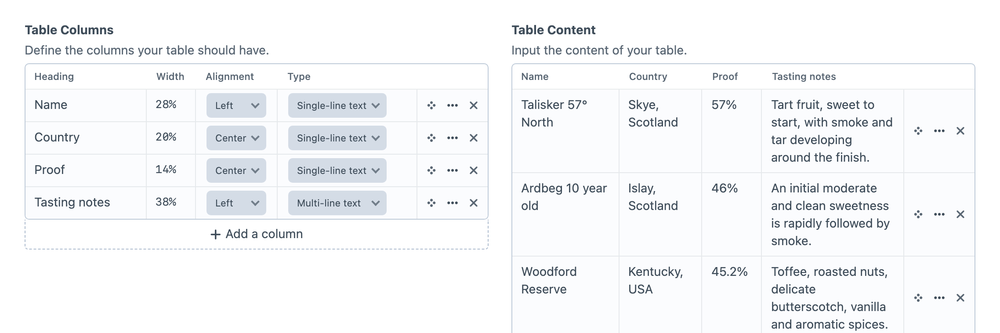

<!-- feature-intro -->
Table Maker lets authors create the rows and columns their content needs, not only the schema a developer predicted. Capture genuinely tabular information in Craft and render it with complete template control.
<!-- feature-intro-end -->

<!-- feature-section media-size="large" media-shadow="false" -->
## Author-defined tables

Authors can add and label columns and rows directly in the field, making the format useful for comparison tables, schedules, specifications, and other data whose dimensions vary between entries.

<!-- feature-section-end -->

<!-- feature-section -->
## Template-controlled output

Table Maker stores the table structure and cell content while Twig decides the final HTML and responsive treatment. Developers can provide accessible, project-specific markup instead of accepting a fixed front-end widget.
<!-- feature-section-end -->
