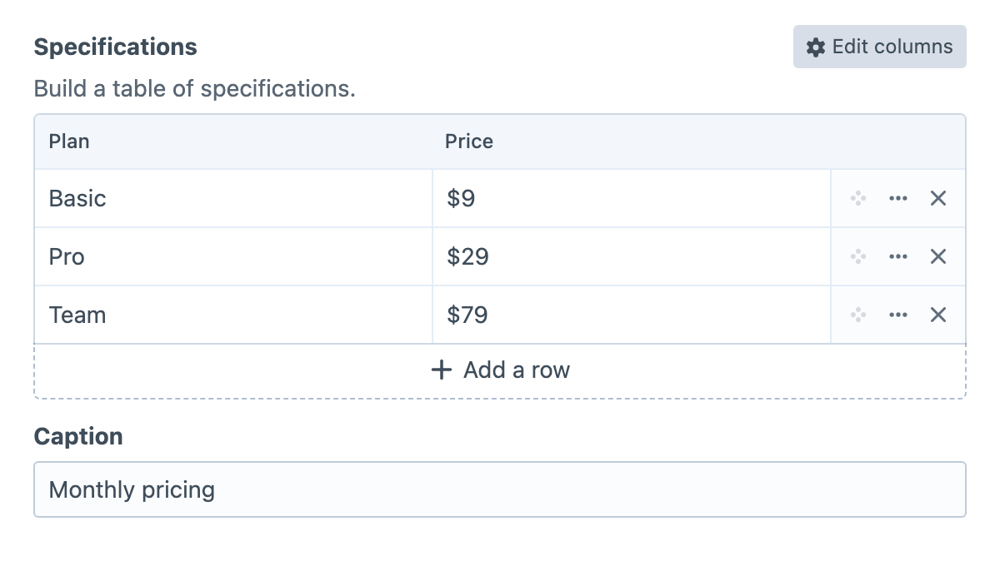
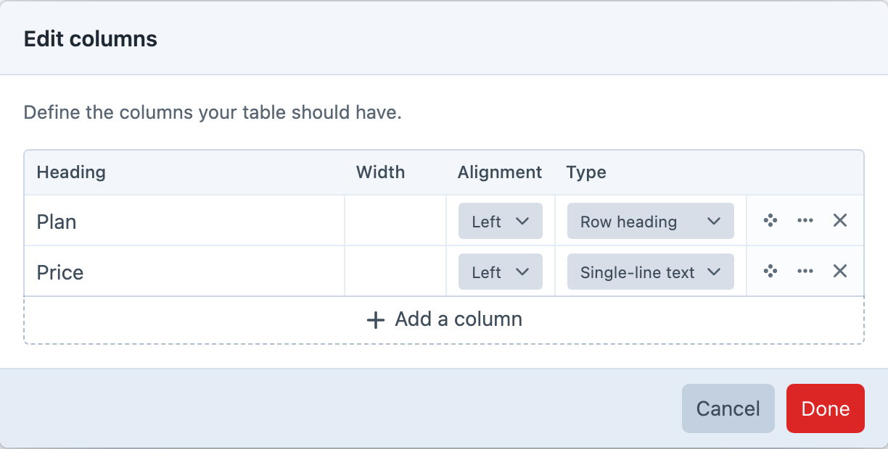

<!-- feature-intro -->
Table Maker lets authors create the rows and columns their content needs, not only the schema a developer predicted. Capture genuinely tabular information in Craft and render it with complete template control.
<!-- feature-intro-end -->

<!-- feature-section media-size="large" media-shadow="false" -->
## Author-defined tables

Authors can add and label columns and rows directly in the field, making the format useful for comparison tables, schedules, specifications, and other data whose dimensions vary between entries.

<!-- feature-section-end -->

<!-- feature-media -->
## Structure without a rigid schema

Choose the column types, headings, widths and alignment that make each table meaningful. Field settings can narrow the available types and set sensible row or column boundaries without forcing every entry into the same shape.

<!-- feature-media-end -->

<!-- feature-grid -->
- :icon[clipboard-text] **Paste spreadsheet data** Start from a focused cell and paste rows and columns, expanding the table within its configured limits.
- :icon[text-size] **Rich content where needed** Use formatted cells with modal or inline editing when Craft’s CKEditor plugin is available.
- :icon[table] **Meaningful table structure** Store captions and row headings alongside the data for more useful front-end markup.
<!-- feature-grid-end -->

<!-- feature-section -->
## Template-controlled output

Table Maker keeps column settings, rows and cells available to Twig and GraphQL while templates decide the final HTML and responsive treatment. Developers can use the built-in output or provide accessible, project-specific markup instead of accepting a fixed front-end widget.
<!-- feature-section-end -->
